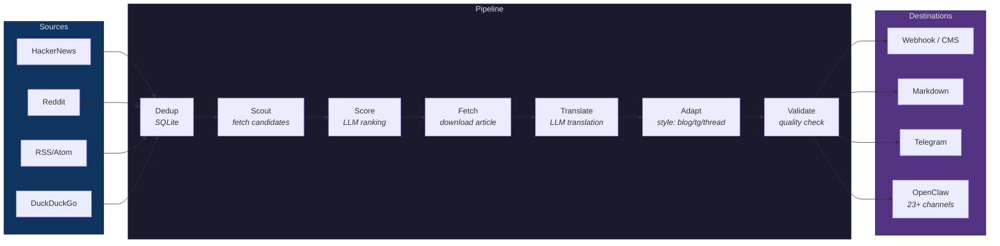
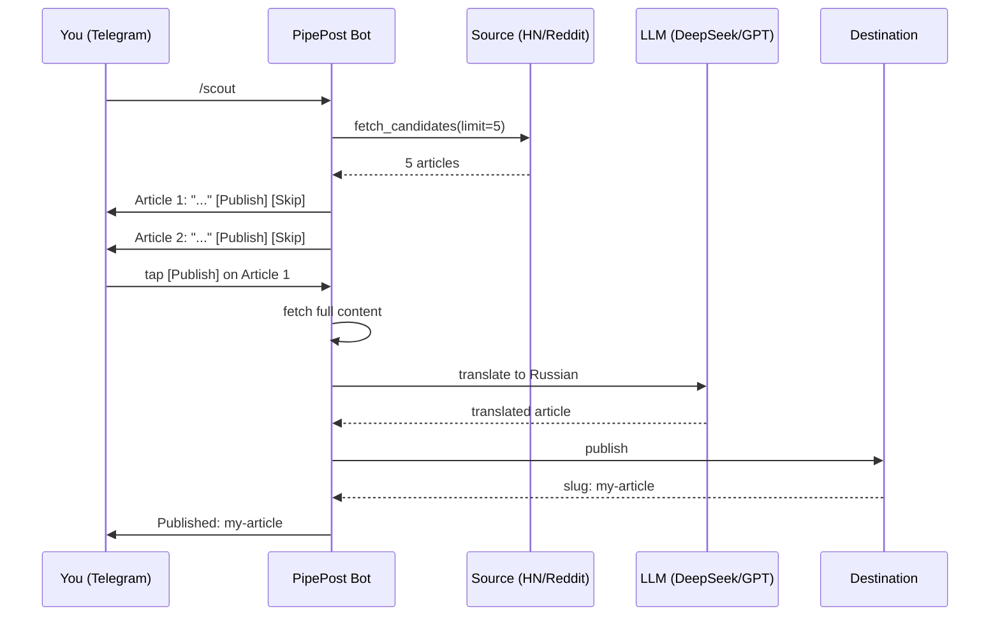
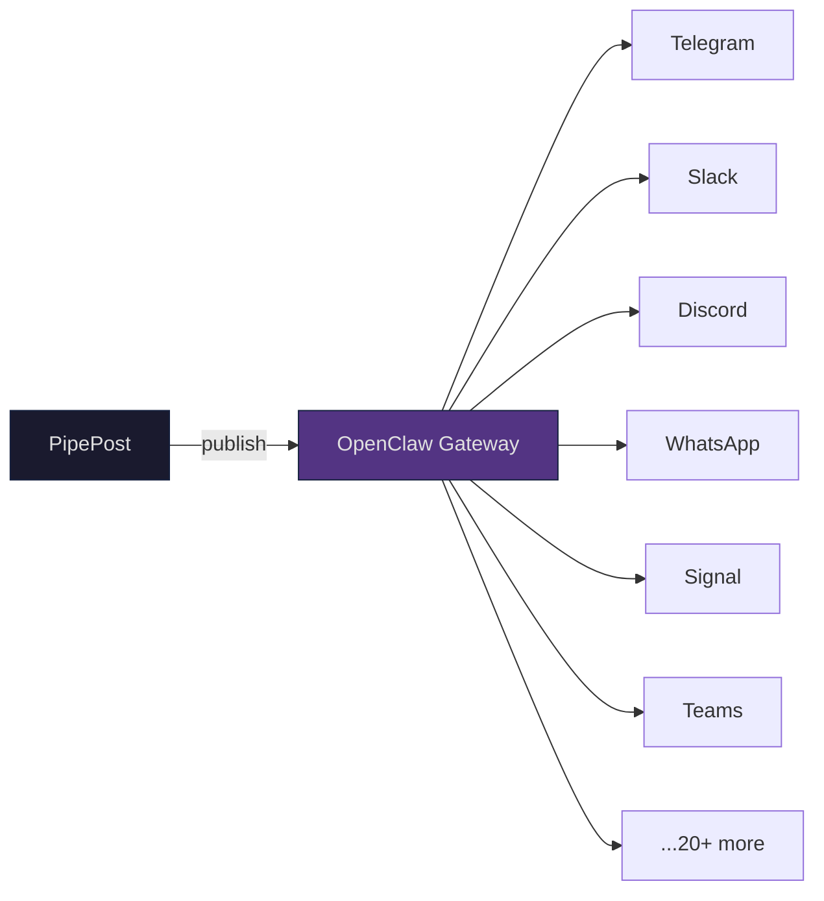

```
         _                          _
 _ __ (_)_ __   ___ _ __   ___  ___| |_
| '_ \| | '_ \ / _ \ '_ \ / _ \/ __| __|
| |_) | | |_) |  __/ |_) | (_) \__ \ |_
| .__/|_| .__/ \___| .__/ \___/|___/\__|
|_|     |_|        |_|
```

[](https://github.com/densul/pipepost/actions/workflows/ci.yml)
[](https://pypi.org/project/pipepost/)
[](https://www.python.org/downloads/)
[](https://github.com/densul/pipepost)
[](https://github.com/densul/pipepost)
[](LICENSE)
[](https://github.com/astral-sh/ruff)

# PipePost

**Open-source AI content curation pipeline** -- scout, translate, and publish articles from any domain automatically.

```
                        P I P E L I N E

  SOURCES          SCOUT       TRANSLATE     PUBLISH         DESTINATIONS
 ----------       -------      ---------     -------        --------------
  HackerNews        |             |             |            Webhook / CMS
  Reddit      ----> | Score  ---> | Adapt  ---> | Fanout --> Telegram
  RSS/Atom          | Rank        | Style       | to N       Markdown
  DuckDuckGo        |             |             |            OpenClaw (23+)
  Custom            |             |             |            Custom
```

PipePost discovers articles from sources like HackerNews, Reddit, RSS feeds, and search engines, translates them to your target language using AI, and publishes to your blog or CMS. Works for any niche -- tech, business, health, lifestyle, and more.

<p align="center">
  
</p>

---

## Table of Contents

- [Features](#features)
- [Quick Start](#quick-start)
- [Architecture](#architecture)
- [Use Cases](#use-cases)
- [Sources](#sources)
- [Destinations](#destinations)
- [Steps](#steps)
- [Configuration](#configuration)
- [Telegram Bot](#telegram-bot)
- [OpenClaw Integration](#openclaw-integration)
- [Adding a Custom Source](#adding-a-custom-source)
- [Adding a Custom Destination](#adding-a-custom-destination)
- [Supported LLM Models](#supported-llm-models)
- [Docker](#docker)
- [Development](#development)
- [Contributing](#contributing)
- [License](#license)

## Features

- 📡 **Multiple Sources** — HackerNews, Reddit, RSS/Atom, DuckDuckGo search
- 🌍 **AI Translation** — Full paragraph-by-paragraph translation via any LLM (DeepSeek, Claude, GPT, Qwen, etc.)
- 📝 **Multiple Destinations** — Webhook, Markdown, Telegram, OpenClaw (23+ channels)
- 🤖 **Telegram Bot** — Interactive curation: scout candidates, approve/reject via inline buttons
- 🎯 **Smart Scoring** — LLM-based candidate ranking by relevance, originality, and engagement
- ✍️ **Style Adaptation** — Adapt content for blog, Telegram, newsletter, or Twitter thread
- 📢 **Fanout Publish** — Publish to multiple destinations simultaneously
- 📦 **Batch Mode** — Process multiple articles in one run (`--batch -n 5`)
- 🔄 **Composable Flows** — Chain steps: dedup → scout → score → fetch → translate → adapt → publish
- 💾 **Deduplication** — SQLite-backed persistence prevents re-publishing across runs
- 📊 **Prometheus Metrics** — Pipeline runs, step durations, error counters (optional)
- ⚙️ **Config-Driven Flows** — Define entire pipelines in YAML without writing Python
- 🧩 **Plugin Architecture** — Add sources and destinations with a single file
- 🔁 **Resilient Retries** — Exponential backoff with jitter for LLM calls (via tenacity)
- 🚦 **Rate Limiting** — Built-in semaphore-based concurrency control for external APIs
- 🔐 **Secret References** — Use `${ENV_VAR}` in YAML configs to keep secrets out of files
- 🐳 **Docker Ready** — `docker compose up` and go

## Quick Start

```bash
# Install from PyPI
pip install pipepost

# Or from source
git clone https://github.com/DenSul/pipepost && cd pipepost
pip install -e .

# Configure
export PIPEPOST_MODEL=deepseek/deepseek-chat
export DEEPSEEK_API_KEY=your-key  # or OPENAI_API_KEY, ANTHROPIC_API_KEY, etc.

# List available components
pipepost sources
pipepost destinations
pipepost styles
pipepost flows

# Run a pipeline flow
pipepost run default --source hackernews --dest webhook --lang ru

# Preview without publishing (dry run)
pipepost run default --source hackernews --dry-run

# Batch mode — process multiple articles
pipepost run default --source hackernews --batch -n 5

# Use a config file
pipepost run --config pipepost.yaml --source hackernews

# Run interactive Telegram bot
export TELEGRAM_BOT_TOKEN=your-bot-token
pipepost bot --source hackernews --lang ru

# Check health
pipepost health
```

**Example batch output:**

```
$ pipepost run default --source hackernews --batch -n 3 --lang ru

Batch: processed 3 article(s)
  [1] Восемь лет желания, три месяца работы с ИИ | 2026-04-05-vosem-let-zhelaniya | ok
  [2] Финская сауна усиливает иммунный ответ    | 2026-04-05-finskaya-sauna       | ok
  [3] Утечка email-адресов в BrowserStack        | 2026-04-05-utechka-email        | ok
```

## Architecture



Every step is independent and composable. Define your pipeline in YAML -- no Python needed:

```yaml
# pipepost.yaml — full pipeline config
sources:
  - name: hackernews
    min_score: 100

translate:
  model: deepseek/deepseek-chat
  target_lang: ru

destination:
  type: markdown
  output_dir: ./output

flow:
  steps: [dedup, scout, score, fetch, translate, validate, publish, post_publish]
  score:
    niche: tech
  storage:
    db_path: pipepost.db
```

```bash
pipepost run --config pipepost.yaml --source hackernews
```

Add or remove steps from the `flow.steps` list to customize your pipeline. Available steps: `dedup`, `scout`, `score`, `fetch`, `translate`, `adapt`, `validate`, `publish`, `fanout_publish`, `post_publish`.

<details>
<summary>Advanced: custom flows in Python</summary>

```python
from pipepost.core import Flow
from pipepost.steps import (
    AdaptStep, DeduplicationStep, FanoutPublishStep, FetchStep,
    PostPublishStep, ScoutStep, ScoringStep, TranslateStep, ValidateStep,
)
from pipepost.storage import SQLiteStorage

storage = SQLiteStorage(db_path="my_project.db")

my_flow = Flow(
    name="my-pipeline",
    steps=[
        DeduplicationStep(storage=storage),
        ScoutStep(max_candidates=20),
        ScoringStep(niche="tech", max_score_candidates=5),
        FetchStep(max_chars=15000),
        TranslateStep(model="deepseek/deepseek-chat", target_lang="ru"),
        AdaptStep(style="telegram"),
        ValidateStep(min_content_len=500),
        FanoutPublishStep(destination_names=["webhook", "telegram", "markdown"]),
        PostPublishStep(storage=storage),
    ],
)
```
</details>

## Use Cases

### Cooking & Food
```yaml
sources:
  - name: food-news
    type: reddit
    subreddits: [cooking, recipes, AskCulinary]
  - name: food-search
    type: search
    queries:
      - "new restaurant trends 2026"
      - "seasonal recipes spring"
```

### Travel & Adventure
```yaml
sources:
  - name: travel-news
    type: search
    queries:
      - "best travel destinations 2026"
      - "budget travel tips Europe"
      - "digital nomad guides"
```

### Finance & Investing
```yaml
sources:
  - name: finance-news
    type: reddit
    subreddits: [personalfinance, investing]
  - name: finance-search
    type: search
    queries:
      - "stock market analysis today"
      - "personal finance strategies"
```

### Health & Science
```yaml
sources:
  - name: health-news
    type: search
    queries:
      - "health research breakthroughs"
      - "nutrition science news"
      - "mental health studies"
```

### Tech & Programming
```yaml
sources:
  - name: tech-news
    type: search
    queries:
      - "latest AI research papers"
      - "open source projects trending"
```

### Sports & Fitness
```yaml
sources:
  - name: sports-news
    type: reddit
    subreddits: [sports, fitness, running]
  - name: sports-search
    type: search
    queries:
      - "sports highlights this week"
      - "fitness training programs"
```

## Sources

| Source | Type | Description |
|--------|------|-------------|
| `hackernews` | API | Top stories from Hacker News (Firebase API) |
| `reddit` | API | Top posts from configurable subreddits |
| `rss` | RSS/Atom | Any RSS or Atom feed URL |
| `search` | DuckDuckGo | Keyword-based article search |

## Destinations

| Destination | Description |
|-------------|-------------|
| `webhook` | POST to any URL (WordPress REST API, Ghost, custom) |
| `markdown` | Save as `.md` files with YAML frontmatter |
| `telegram` | Post to Telegram channels/chats via Bot API |
| `openclaw` | Route through [OpenClaw](https://github.com/openclaw/openclaw) to 23+ messaging platforms |

## Steps

| Step | Description |
|------|-------------|
| `dedup` | Load published URLs from SQLite to prevent re-processing |
| `scout` | Fetch candidates from a source (HN, Reddit, RSS, search) |
| `score` | LLM-based candidate ranking by relevance, originality, engagement |
| `fetch` | Download article, extract content as markdown, get og:image |
| `translate` | Translate via LLM (LiteLLM — supports 100+ models) |
| `adapt` | Adapt content style: blog, telegram, newsletter, or thread |
| `validate` | Check translation quality (length, ratio, required fields) |
| `publish` | Send to a single configured destination |
| `fanout_publish` | Publish to multiple destinations concurrently |
| `images` | Download images from article content and rewrite URLs to local paths |
| `post_publish` | Persist published URL to SQLite for future deduplication |

## Configuration

All configuration lives in `pipepost.yaml`. Priority: CLI flags > env vars > YAML > defaults.

```yaml
# pipepost.yaml — complete example
sources:
  - name: hackernews
    min_score: 100
  - name: my-blog
    type: rss
    url: https://example.com/feed.xml
  - name: daily-search
    type: search
    queries:
      - "latest news in your niche"
      - "trending articles today"

destination:
  type: webhook
  url: https://myblog.com/api/posts/auto-publish
  headers:
    Authorization: "Bearer your-token"

translate:
  model: deepseek/deepseek-chat
  target_lang: ru

flow:
  steps: [dedup, scout, score, fetch, translate, validate, publish, post_publish]
  on_error: stop
  score:
    model: gpt-4o-mini  # optional: cheaper model for scoring
    niche: tech
  adapt:
    model: claude-sonnet-4-20250514  # optional: different model for style adaptation
    style: telegram
  publish:
    destination_name: webhook
  storage:
    db_path: pipepost.db
```

**Env var overrides:** `PIPEPOST_MODEL`, `PIPEPOST_LANG`, `PIPEPOST_DEST_URL`

**Secret references in YAML:** Use `${ENV_VAR}` syntax to reference environment variables directly in config values. This is useful for keeping secrets out of config files:

```yaml
destination:
  type: telegram
  bot_token: "${TELEGRAM_BOT_TOKEN}"
  chat_id: "${TELEGRAM_CHAT_ID}"
```

See [examples/pipepost.yaml](examples/pipepost.yaml) for more examples.

## Adding a Custom Source

Create a single file — PipePost auto-discovers it:

```python
# pipepost/sources/my_source.py
from pipepost.sources.base import Source
from pipepost.core.context import Candidate
from pipepost.core.registry import register_source


class MySource(Source):
    name = "my-source"
    source_type = "api"

    async def fetch_candidates(self, limit: int = 10) -> list[Candidate]:
        # Your logic here
        return [Candidate(url="https://...", title="...", source_name=self.name)]


register_source("my-source", MySource())
```

## Adding a Custom Destination

```python
# pipepost/destinations/my_cms.py
from pipepost.destinations.base import Destination
from pipepost.core.context import PublishResult, TranslatedArticle
from pipepost.core.registry import register_destination


class MyCMSDestination(Destination):
    name = "my-cms"

    async def publish(self, article: TranslatedArticle) -> PublishResult:
        # Your CMS API logic here
        return PublishResult(success=True, slug="article-slug")


register_destination("my-cms", MyCMSDestination())
```

## Adding a Custom Style

Register new adapt styles without modifying existing code:

```python
from pipepost.core.registry import register_style

register_style("twitter", """
Adapt the article into a Twitter/X thread format:
- First tweet: hook + key insight (max 280 chars)
- Follow-up tweets: supporting points
- Last tweet: source link + call to action
""")
```

Then use it: `pipepost run default --source hackernews` with `flow.adapt.style: twitter` in your config.

## Telegram Bot

PipePost includes an interactive Telegram bot for human-in-the-loop content curation:

```bash
export TELEGRAM_BOT_TOKEN=your-bot-token
pipepost bot --source hackernews --lang ru
```



**How it works:**
1. Send `/scout` to the bot
2. Bot fetches candidates and shows them with inline buttons
3. Tap **Publish** — bot runs the full pipeline (fetch → translate → validate → publish)
4. Tap **Skip** — bot moves to the next candidate

**Telegram as a destination** (automated, no approval needed):

```yaml
destination:
  type: telegram
  bot_token: "your-bot-token"
  chat_id: "@your_channel"
```

## OpenClaw Integration

PipePost integrates with [OpenClaw](https://github.com/openclaw/openclaw) -- a self-hosted AI assistant platform with 23+ messaging channels.



**As a destination** -- publish through OpenClaw to all connected channels:

```yaml
destination:
  type: openclaw
  gateway_url: "ws://127.0.0.1:18789"
  session_id: "my-session"
  channels: ["telegram", "slack", "discord"]
```

**As an OpenClaw skill** — see [examples/openclaw-skill/SKILL.md](examples/openclaw-skill/SKILL.md) for a ready-to-use skill that lets OpenClaw agents curate content via PipePost.

## Supported LLM Models

PipePost uses [LiteLLM](https://github.com/BerriAI/litellm) for translation, supporting 100+ models:

- **DeepSeek** — `deepseek/deepseek-chat`, `deepseek/deepseek-reasoner`
- **OpenAI** — `gpt-4o`, `gpt-4o-mini`
- **Anthropic** — `claude-sonnet-4-20250514`, `claude-haiku-4-20250414`
- **Google** — `gemini/gemini-2.0-flash`
- **Local** — `ollama/llama3.1`, any Ollama model

Set via `PIPEPOST_MODEL` env var or in YAML config.

## Docker

```bash
# Build and run
docker compose up -d

# Or build manually
docker build -t pipepost .
docker run -v ./pipepost.yaml:/app/config/pipepost.yaml pipepost run default
```

## Development

```bash
git clone https://github.com/DenSul/pipepost
cd pipepost
python -m venv .venv && source .venv/bin/activate
pip install -e ".[dev,metrics]"

# Lint
ruff check pipepost/

# Type check
mypy --strict pipepost/

# Test
pytest tests/

# Integration tests (hits real APIs)
pytest tests/test_integration.py -v
```

## Contributing

Contributions are welcome! Please read [CONTRIBUTING.md](CONTRIBUTING.md) for guidelines on how to get started.

In short: fork, branch, make your changes, run `ruff check`, `mypy --strict`, and `pytest`, then open a PR.

## License

[AGPL-3.0](LICENSE) -- Free to use, modify, and self-host. If you offer PipePost as a hosted service, you must open-source your modifications.

---

Built by [Denis Sultanov](https://github.com/DenSul)
